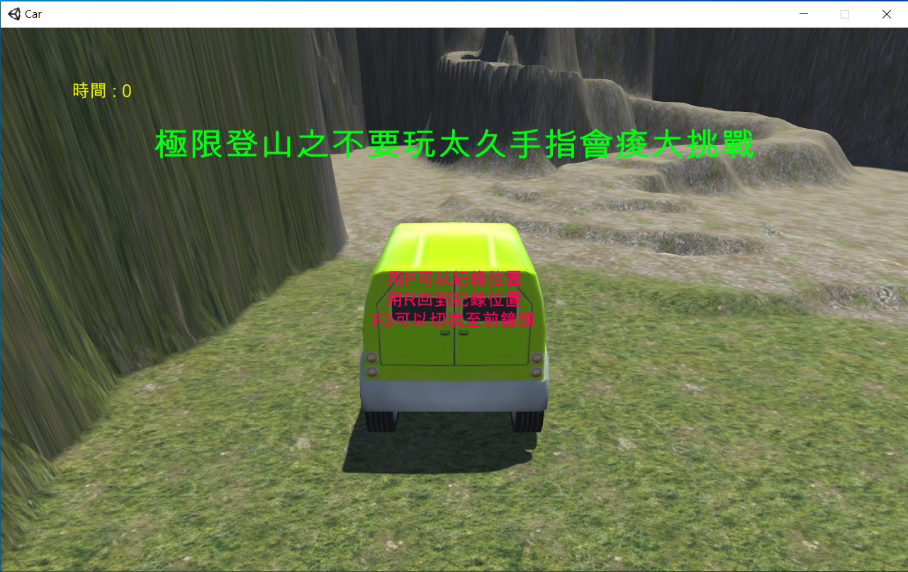
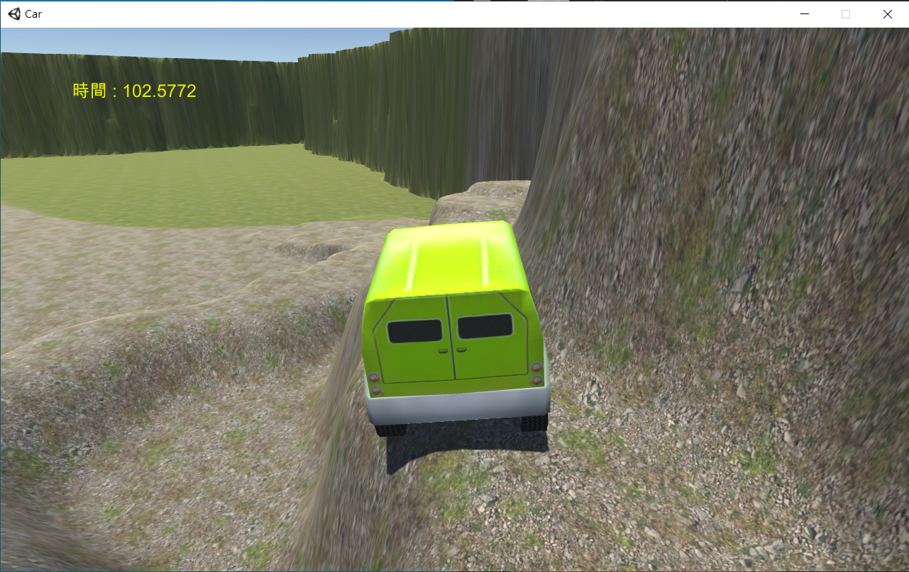
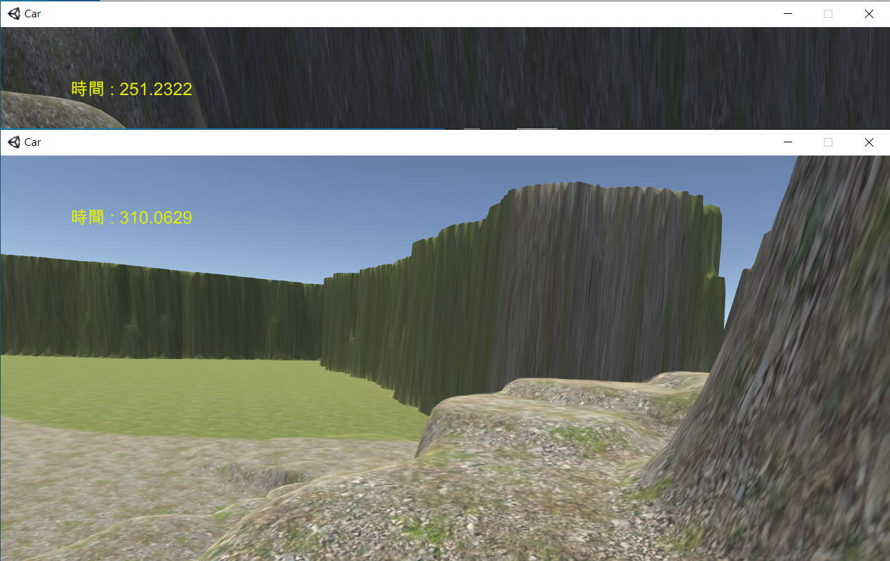
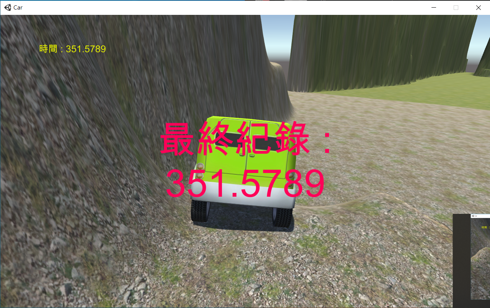

# 極限登山車

*大二 - 遊戲程式設計專案*

## 製作動機

那時候有許多磨練心志的遊戲，總是會設計的很困難，失敗就要重很遠的地方重來，我那時候就想說也來設計類似這種的遊戲，我就想到我可以來做做看車子的遊戲，因為我也滿喜歡賽車遊戲。

## 製作過程

在製作的過程中，我一直翻找許多資料，關於車子的類似催油門效果應該如何做出，然後在地圖方面，我也是花了許多時間設計，其中我設計了根本不可能出現在現實中的道路，要行駛過去非常困難，我自己做出來是還蠻開心的啦。

## 使用說明

1. 開啟 Car.exe

2. 調整解析度和是否全螢幕 (建議不要全螢幕)

3. 開始遊戲

## 遊戲說明

1. 遊戲目標為駕駛車子登山並且成功至另外一端下山

2. 使用方向鍵朝各方向加速

3. 使用R可以回到紀錄點 (預設是起始位置)

3. 使用P可以更換紀錄點 (總共只能使用3次)

4. 按住F3可以使用前鏡頭

## 遊戲畫面

1. 開始畫面

    

2. 爬坡畫面

    

3. 前鏡頭畫面

    

4. 成功畫面

    
